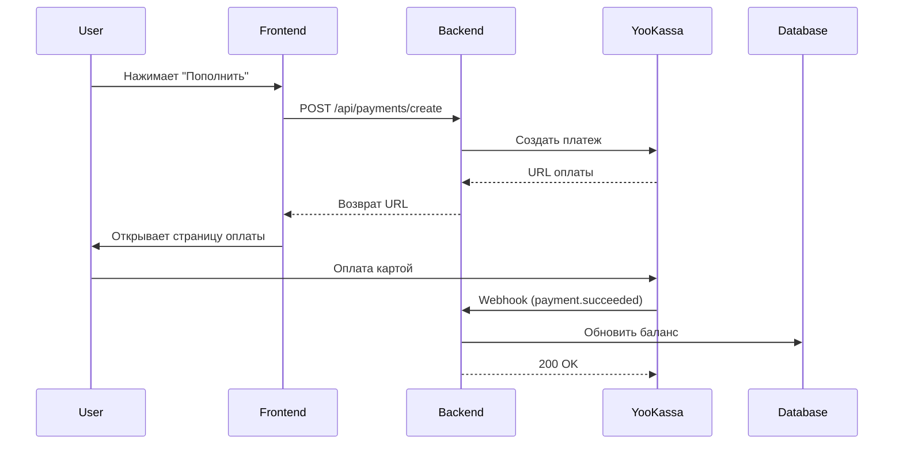
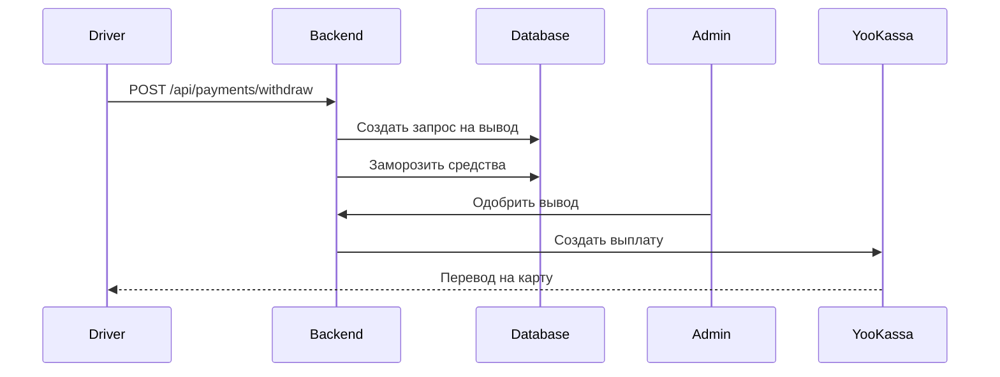

# 💳 Настройка платежной системы YooKassa

Руководство по подключению платежей для пополнения баланса и вывода средств.

## 🚀 Быстрая настройка

### 1. Регистрация в ЮKassa

1. Перейдите на https://yookassa.ru/
2. Нажмите "Подключить ЮKassa"
3. Заполните данные вашей компании (ИП или ООО)
4. Дождитесь подтверждения (обычно 1-3 рабочих дня)

### 2. Получение ключей API

После одобрения:

1. Войдите в личный кабинет ЮKassa
2. Перейдите в раздел **Настройки → API**
3. Скопируйте:
   - **shopId** - идентификатор магазина
   - **Секретный ключ** - для API запросов

### 3. Настройка в проекте

Добавьте ключи в файл `backend/.env`:

```env
YOOKASSA_SHOP_ID=123456
YOOKASSA_SECRET_KEY=live_ваш_секретный_ключ
```

### 4. Настройка Webhook

Webhook нужен для автоматического зачисления средств после оплаты.

1. В личном кабинете ЮKassa перейдите **Настройки → Уведомления**
2. Включите "HTTP-уведомления"
3. Укажите URL:
   ```
   https://your-backend.com/api/payments/webhook/yookassa
   ```
4. Выберите события:
   - ✅ `payment.succeeded` - успешная оплата
   - ✅ `payment.canceled` - отмена оплаты
5. Сохраните настройки

### 5. Тестирование

Для тестирования используйте **тестовые карты**:

| Карта | Результат |
|-------|-----------|
| `5555 5555 5555 4477` | Успешная оплата |
| `5555 5555 5555 5599` | Отклонено банком |

**Важно:**
- CVC: любые 3 цифры
- Срок действия: любая дата в будущем
- 3D-Secure код: любые 6 цифр

---

## 📊 Как работают платежи

### Пополнение баланса



### Вывод средств



---

## 💰 Комиссии

### Комиссия ЮKassa

- **Банковские карты:** 2.8% + 10₽
- **ЮMoney кошелек:** 2%
- **СБП (Система Быстрых Платежей):** 0.4% - 0.7%

### Комиссия платформы

Установлена в коде (можно изменить):
- **За услуги:** 10% от суммы заказа
- **За товары:** настраивается продавцом

---

## 🔧 Кастомизация

### Изменение минимальной суммы пополнения

Файл: `backend/src/controllers/payments.controller.ts`

```typescript
if (amount < 100) {  // Измените это значение
  res.status(400).json({ error: 'Минимальная сумма пополнения - 100 рублей' });
  return;
}
```

### Изменение предустановленных сумм

Файл: `src/components/top-up-balance.tsx`

```typescript
const PRESET_AMOUNTS = [500, 1000, 2000, 5000];  // Измените эти значения
```

### Добавление других методов оплаты

ЮKassa поддерживает:
- 💳 Банковские карты (Visa, MasterCard, Мир)
- 💰 ЮMoney кошелек
- 📱 СБП (Система Быстрых Платежей)
- 🏦 Интернет-банкинг (Сбербанк Онлайн, Альфа-Клик и др.)
- 🏪 Наличные (через терминалы)

Настройка в `backend/src/utils/yookassa.ts`:

```typescript
confirmation: {
  type: 'redirect',
  return_url: `${process.env.FRONTEND_URL}/profile?payment=success`,
},
payment_method_data: {
  type: 'bank_card',  // или 'yoo_money', 'sbp' и т.д.
},
```

---

## 🛡️ Безопасность

### Рекомендации:

1. **Никогда не храните ключи в коде**
   ```bash
   # ❌ Плохо
   const SECRET_KEY = 'live_abc123';

   # ✅ Хорошо
   const SECRET_KEY = process.env.YOOKASSA_SECRET_KEY;
   ```

2. **Используйте HTTPS в production**
   - ЮKassa требует HTTPS для webhook
   - Без SSL платежи работать не будут

3. **Настройте IP whitelist**
   - В ЮKassa укажите IP вашего сервера
   - Это защитит от поддельных webhook

4. **Проверяйте статус платежа**
   ```typescript
   // Всегда проверяйте статус перед зачислением
   if (payment.status === 'succeeded') {
     // Зачислить средства
   }
   ```

---

## 📱 Интеграция с Telegram Mini App

### Особенности:

1. **Открытие в новом окне**
   ```javascript
   // YooKassa откроется в браузере, а не в Telegram
   window.open(confirmationUrl, '_blank');
   ```

2. **Проверка статуса вручную**
   После оплаты пользователь вернется в Telegram. Добавьте кнопку "Проверить оплату":
   ```typescript
   const checkStatus = async (paymentId: string) => {
     const response = await fetch(
       `/api/payments/${paymentId}/status`
     );
     // Обновить баланс
   };
   ```

3. **Альтернатива: Telegram Stars**
   Для полностью встроенной оплаты используйте Telegram Stars (криптовалюта Telegram).

---

## 🧪 Тестирование

### Локальное тестирование webhook

Для тестирования webhook локально используйте **ngrok**:

```bash
# 1. Установите ngrok
brew install ngrok  # macOS
# или скачайте с https://ngrok.com/

# 2. Запустите туннель
ngrok http 3001

# 3. Скопируйте URL (например, https://abc123.ngrok.io)
# 4. Укажите в ЮKassa: https://abc123.ngrok.io/api/payments/webhook/yookassa
```

### Проверка webhook вручную

```bash
curl -X POST http://localhost:3001/api/payments/webhook/yookassa \
  -H "Content-Type: application/json" \
  -d '{
    "type": "payment.succeeded",
    "object": {
      "id": "test-payment-id",
      "status": "succeeded",
      "amount": {
        "value": "1000.00",
        "currency": "RUB"
      },
      "metadata": {
        "userId": "user-id-here"
      }
    }
  }'
```

---

## 📞 Поддержка

### Проблемы с ЮKassa:

- 📧 Email: support@yookassa.ru
- 📱 Телефон: 8 800 250-66-99
- 💬 Онлайн-чат в личном кабинете

### Полезные ссылки:

- [Документация API](https://yookassa.ru/developers/api)
- [SDK для Node.js](https://github.com/yoomoney/yookassa-sdk-nodejs)
- [Тестовые данные](https://yookassa.ru/developers/payment-acceptance/testing-and-going-live/testing)
- [Примеры интеграции](https://yookassa.ru/developers/payment-acceptance/scenario-extensions)

---

## ✅ Checklist перед запуском

- [ ] Зарегистрирован аккаунт в ЮKassa
- [ ] Получены shopId и secretKey
- [ ] Добавлены в `.env` файл
- [ ] Настроен webhook URL
- [ ] Протестировано на тестовых картах
- [ ] Проверено зачисление средств
- [ ] Настроен HTTPS для production
- [ ] Добавлен IP whitelist
- [ ] Проверен возврат средств (refund)

---

**Готово! Теперь пользователи могут пополнять баланс через ЮKassa! 🎉**
